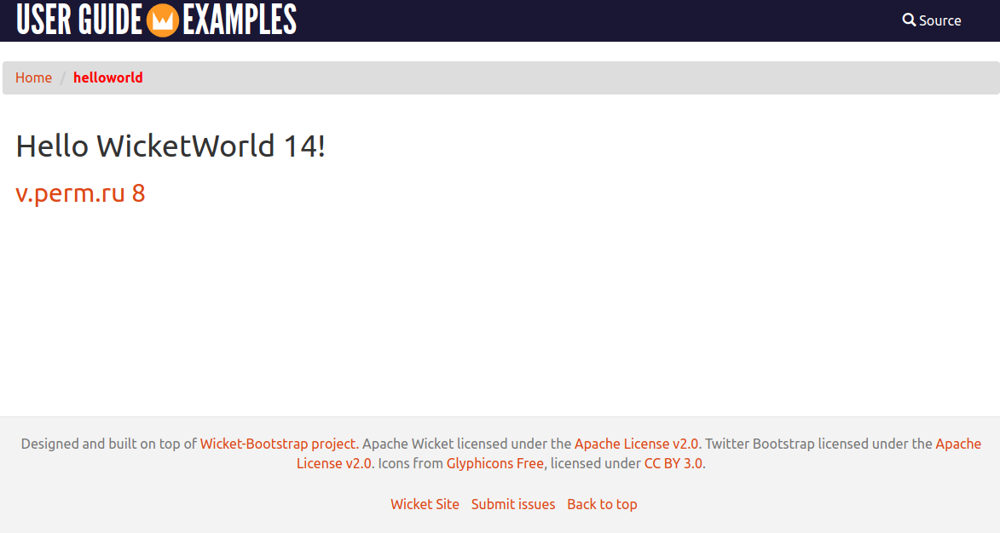

### Простое Wicket приложение

В проекте Spring Boot __НЕ ИСПОЛЬЗУЕТСЯ__.

Сборка war файла:

````shell
mvn package
````

Запуск приложения:

````shell
mvn jetty:run
````

или:

````shell
./run.sh
````

Открыть в браузере [http://127.0.0.1:8080/](http://127.0.0.1:8080/) 



### Пример изменения цвета ссылки

Исходное значение определенное в правиле 
src/main/java/org/wicketTutorial/commons/bootstrap/layout/style.css
(строка 166)

````css
a {
    color: #DD4814;
}
````

Изменено в my.css (строка 56) на :

````css
a, a:visited, a:hover, a:active {
    color : #FF5500;
}
````

Ссылки:

- [Разработка Web-приложений с использованием Wicket(rsdn.ru)](https://www.rsdn.org/article/inet/Wicket.xml)
- [Wicket Tutorial (mkyong)](https://mkyong.com/tutorials/wicket-tutorials/)
- [Примеры из книги Apache Wicket Cookbook](https://resources.oreilly.com/examples/9781849511605/-/tree/master?ref_type=heads)